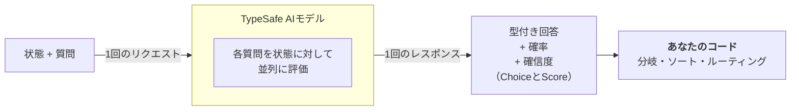

> ## ドキュメント索引 {#documentation-index}
> ドキュメント全体の索引は次のURLで取得できます: https://docs.typesafe.ai/llms.txt
> さらに詳しく調べる前に、このファイルで利用可能なページを確認してください。

# はじめに {#introduction}

> JevはTypeSafeのフラッグシップモデルであり、最初の System Oneモデルです。状態と型付きの質問を送ると、コードがそのまま使える構造化された回答が返ってきます。

大規模言語モデル（LLM）は、人間が読むためのテキストを生成するように設計されています。コードが消費するための判断をモデルに行わせたい場合、そこにミスマッチが生じます。テキスト生成システムに構造化された決定を無理に出力させ、その結果をコードが依存できる形にもう一度パースし直す、という流れになってしまうのです。

Jevは、TypeSafeのフラッグシップモデルであり、最初の [System Oneモデル](/concepts/system-one) です。System Oneモデルは、ソフトウェアがそのまま使える高速な構造化判断を行うために作られています。Jevは型付きの*質問*を*状態*に対して評価し、構造化された結果を直接返します。テキスト生成もパースも不要です。コードが分岐・ソート・ルーティングに使える型付きの値と確率分布がそのまま得られます。ChoiceとScoreは[確信度（confidence）](/confidence)も返すため、コードはその回答にどう対応するか、そもそも対応すべきかを判断できます。

## TypeSafeのプリミティブ {#typesafe-primitives}

TypeSafeは3つの*AIプリミティブ*を公開しています。ソフトウェアのプリミティブと同様に、TypeSafeのAIプリミティブはモジュール化され、組み合わせ可能で、構造化されており、信頼性が高く、高速です。それぞれ異なる種類の*質問*を投げかけ、異なる種類の回答を返します。

| 質問タイプ                     | 目的                             | 戻り値                                    |
| ------------------------------ | -------------------------------- | ------------------------------------------ |
| [Choice](/primitives/choice)   | リストから選択肢を選ぶ           | `choice`, `probabilities`, `confidence`    |
| [Score](/primitives/score)     | ルーブリックに沿って状態を採点する | `score`, `probabilities`, `confidence`     |
| [Noul](/primitives/noul)       | この命題は真か？                 | `noul`（0〜1）                             |

3種類の*質問*はすべて、1回のAPI呼び出しの中で混在させて使えます。すべての*質問*は同じ*状態*に対して、並列かつ独立に一度で評価されます。質問を追加してもレスポンス時間はほとんど変わりません。各質問は独立して評価されるため、質問を増やしてもコンテキストが劣化（コンテキストロット）することはありません。

## コード側で組み合わせる、単一責務の質問 {#atomic-questions-composed-in-code}

System Oneモデルは、それぞれの質問が具体的でスコープの狭い一つのことだけを問うときに最も効果を発揮します。各質問は、適切な文脈があれば知識豊富な人が数秒で判断できるような、直感的な判定だと考えてください。

問いたい内容が高度な推論を必要とする場合や、複数の独立した要因を天秤にかける必要がある場合は、それを分解してください。それぞれの要因を個別の質問として問い、その結果をコード側のロジックで組み合わせます。これにより個々の評価の信頼性が保たれ、各次元の重み付けをどう行うかを完全にコントロールできます。

例えば、「このスタートアップのピッチを評価して」と一つの質問にまとめる代わりに、市場規模・技術的な実現可能性・差別化要因について別々に質問します。そのスコアを自分たちの計算式で組み合わせます。優先順位が変わったときは、プロンプトを書き直すのではなく、コード内の係数を変更するだけで済みます。

## 次のステップ {#next-steps}

* [クイックスタート](/introduction/quickstart) — すぐに始めるために必要なことすべて。
* [AIプライマー](/introduction/machine-learning-primer) — TypeSafeが生成テキストではなく、キャリブレーションされた判断のためにモデルを訓練している理由。
* [プリミティブ（質問）](/primitives) — 質問の定義方法、Choice・Score・Noulの選び方、複数の質問を同時に問う方法。
* [確信度（Confidence）](/confidence) — TypeSafeが確信度をどのように報告するか、そしてそれをアーキテクチャ上どう使うか。
* [パターン](/patterns) — TypeSafeでシステムを構築する際の一般的なパターン。
