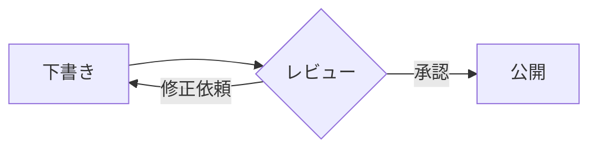
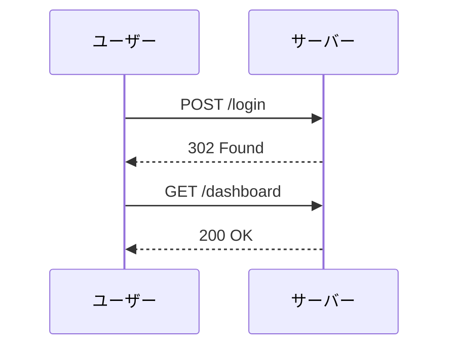

## 拡張 Markdown 構文

拡張構文は、コアの Markdown 仕様を超えた機能を追加します。このページでは、このレンダラーがサポートする GitHub Flavored Markdown (GFM) の拡張機能と、追加のプラグインが必要な一般的な拡張構文を扱います。

---

## 取り消し線

`~~二重チルダ~~` でテキストを囲みます。

```
価格は ~~$99~~ から **$49** になりました。
```

価格は ~~$99~~ から **$49** になりました。

---

## タスクリスト

未チェックの項目には `- [ ]`、チェック済みの項目には `- [x]` を使います。

```
- [x] スキーマを設計する
- [x] マイグレーションを書く
- [ ] バリデーションを追加する
- [ ] テストを書く
```

- [x] スキーマを設計する
- [x] マイグレーションを書く
- [ ] バリデーションを追加する
- [ ] テストを書く

---

## テーブル

テーブルは列の区切りに `|`、区切り行の配置指定に `:` を使います。

```
| 構文       | 説明             | レンダリング |
|:-----------|:----------------:|:--------:|
| **太字**   | 太字のテキスト   | ✓        |
| *斜体*     | 斜体のテキスト   | ✓        |
| ~~取り消し線~~ | 取り消し線   | ✓        |
| `コード`   | インラインコード | ✓        |
```

| 構文       | 説明             | レンダリング |
|:-----------|:----------------:|:--------:|
| **太字**   | 太字のテキスト   | ✓        |
| *斜体*     | 斜体のテキスト   | ✓        |
| ~~取り消し線~~ | 取り消し線   | ✓        |
| `コード`   | インラインコード | ✓        |

---

## オートリンク

山括弧で囲んだ URL やメールアドレスは、そのままクリック可能なリンクになります。

```
ソースホスティングは <https://github.com> をご覧ください。
お問い合わせは <hello@example.com> までどうぞ。
```

ソースホスティングは <https://github.com> をご覧ください。
お問い合わせは <hello@example.com> までどうぞ。

---

## 脚注

インラインで `[^label]` を追加し、脚注の内容をドキュメント内のどこかで定義します。レンダラーが自動的に文末にまとめて表示します。

```
Markdown は2004年に John Gruber[^gruber] によって作られました。

[^gruber]: John Gruber は、Aaron Swartz と共に Markdown を作成した
           ライター兼ウェブ開発者です。
```

Markdown は2004年に John Gruber[^gruber] によって作られました。

[^gruber]: John Gruber は、Aaron Swartz と共に Markdown を作成したライター兼ウェブ開発者です。

複数の脚注もそれぞれ独立して機能します:

```
仕様[^spec]は構文を定義しています。実装は数多く存在します[^impl]。

[^spec]: https://spec.commonmark.org
[^impl]: Pandoc、kramdown、remark など。
```

仕様[^spec]は構文を定義しています。実装は数多く存在します[^impl]。

[^spec]: https://spec.commonmark.org
[^impl]: Pandoc、kramdown、remark など。

---

## アラート

GitHub スタイルのアラートは、最初の行が単独の `[!TYPE]` マーカーであるとき、引用をカラー付きのコールアウトに変換します。5種類のタイプがサポートされています。

```
> [!NOTE]
> ユーザーが知っておくべき有用な情報。

> [!TIP]
> より良く行うための役立つアドバイス。

> [!IMPORTANT]
> 目標を達成するためにユーザーが必要とする重要な情報。

> [!WARNING]
> 早急な対応が必要な緊急情報。

> [!CAUTION]
> リスクや好ましくない結果についての注意喚起。
```

> [!NOTE]
> ユーザーが知っておくべき有用な情報。

> [!TIP]
> より良く行うための役立つアドバイス。

> [!IMPORTANT]
> 目標を達成するためにユーザーが必要とする重要な情報。

> [!WARNING]
> 早急な対応が必要な緊急情報。

> [!CAUTION]
> リスクや好ましくない結果についての注意喚起。

マーカーは最初の行に単独で置く必要があります — `> [!NOTE] 同じ行にテキスト` は通常の引用のままになります。アラートは [Zenn Syntax](/syntax/zenn-syntax) で説明されている `:::message` コールアウトとスタイルを共有しています。

---

## Mermaid 図

言語識別子に `mermaid` を指定したコードフェンスは、GitHub と同じように、コードではなく図としてレンダリングされます。図のソースはプレーンテキストなので、対応していないエディタでもそのまま読めます。

#### フローチャート

````

````


#### シーケンス図

````

````


> Mermaid は他にも多くの図に対応しています — 状態遷移図、クラス図、ガントチャート、円グラフなど。構文の全容は [Mermaid ドキュメント](https://mermaid.js.org) を参照してください。

---

## 未サポートの拡張構文

以下の拡張構文は他の Markdown 方言ではよく使われますが、このレンダラーでは有効になっていません — 記載のプラグインがない場合、区切り文字はプレーンテキストとしてレンダリングされます。

#### ハイライト

`==ハイライト==` 構文は GFM の一部では **ありません**。`remark-mark-and-unmark` のようなプラグインが必要です。プラグインがない場合、`==` の区切り文字はプレーンテキストとしてレンダリングされます。

```
==この文字はハイライトされるはずです。==
```

プラグインが有効な場合、`<mark>` 要素としてレンダリングされます（デフォルトでは黄色の背景）。

#### 上付き文字・下付き文字

`~sub~` と `^sup^` は標準の GFM ではありません。`remark-sub` / `remark-sup` などが必要です。

```
H~2~O        → H₂O
E = mc^2^    → E = mc²
```

プラグインがない場合、区切り文字はそのまま表示されます。

#### 定義リスト

定義リストは、用語の後に `:` を付けて定義を続ける形式です。GFM ではサポートされておらず、`remark-definition-list` や Pandoc が必要です。

```
Markdown
:   軽量なマークアップ言語。

HTML
:   ウェブページの標準的なマークアップ言語。
```

#### 見出し ID

一部のレンダラーは、見出しの後に `{#custom-id}` を付けることで、ディープリンク用の明示的な `id` 属性を設定できます。

```
## Installation {#installation}
```

GFM レンダラー（GitHub など）は見出しテキストから ID を自動生成します。明示的な ID は Pandoc や一部の静的サイトジェネレーターでサポートされていますが、`remark-gfm` は標準では対応していません。

#### 絵文字ショートコード

`:shortcode:` 構文は GitHub でよく使われますが、実際の絵文字文字に変換するには `remark-emoji` などが必要です。

```
:rocket: :white_check_mark: :warning: :tada:
```

プラグインがない場合、これらはリテラルテキストとしてレンダリングされます。絵文字文字を直接貼り付けることもできます: 🚀 ✅ ⚠️ 🎉
