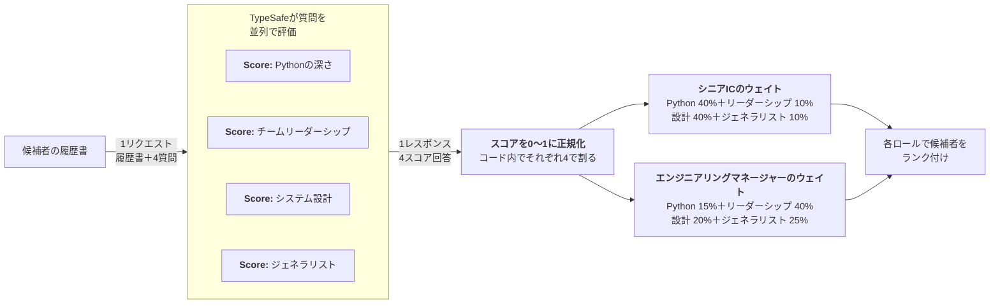

# 複合スコアリング {#composite-scoring}

> 複雑な判断をアトミックなスコアに分解し、コードで制御するウェイトで組み合わせます。

複数の基準を同時に使ってアイテムのセットをランク付けしたい場面はよくあります。複合スコアリングはそのためのシンプルな考え方です。判断を独立した次元に分解し、それぞれを個別にスコアリングし、コードで制御するウェイトで組み合わせます。

## 例：履歴書スクリーニング {#example-resume-screening}

エンジニアリング職の採用で履歴書を処理するケースを想像してください。複数の基準に基づいて候補者をランク付けし、最終的に上位X名をさらに選考する流れです。



### ステップ1：各次元を独立してスコアリングする {#step-1-score-each-dimension-independently}

```json title="questions" theme={null}
{
  "python_depth": {
    "type": "score",
    "instructions": "提供された履歴書に基づき、この候補者はどの程度のPython経験の深さを持っていますか？",
    "criteria": [
      "Pythonの経験についての記載なし",
      "言及はあるが詳細なし",
      "プロジェクトで使用、ある程度の具体的内容あり",
      "主要言語として複数プロジェクトで使用",
      "深い専門知識：アーキテクチャ、パフォーマンス、ライブラリ"
    ]
  },
  "team_leadership": {
    "type": "score",
    "instructions": "この候補者はエンジニアリングチームのマネジメントまたはリードにどの程度の経験を持っていますか？",
    "criteria": [
      "マネジメント経験の記載なし",
      "非公式なメンタリングまたはテックリードの役割",
      "小チームまたはプロジェクトをリード",
      "直属の部下を持つチームをマネジメント",
      "複数チームまたはエンジニアリング組織全体をマネジメント"
    ]
  },
  "system_design": {
    "type": "score",
    "instructions": "この候補者は大規模または分散システムの設計にどの程度の経験を持っていますか？",
    "criteria": [
      "アーキテクチャ業務の記載なし",
      "設計議論への貢献あり",
      "より大きなシステムのコンポーネントを設計",
      "重要なシステムのアーキテクチャを担当",
      "複数ドメインにまたがるシステムをスケールで設計"
    ]
  },
  "generalist": {
    "type": "score",
    "instructions": "この候補者がコアな専門分野以外の慣れないツール、役割、またはドメインを習得してきた証拠はどの程度ありますか？",
    "criteria": [
      "1つのドメインまたは役割のみ記載",
      "ある程度の多様性があるが狭い分野内に限定",
      "いくつかの異なる分野や技術スタックで経験あり",
      "ドメイン間を定期的に移動し、多くの役割を担当",
      "慣れない分野に素早く適応して成果を出した実績あり"
    ]
  }
}
```

### ステップ2：ウェイトで組み合わせる {#step-2-combine-with-weights}

各次元は0〜1に正規化されウェイト付けされます。ウェイトにより、個々のスコアの細かさを失うことなく、各次元の相対的な重要度を簡単に調整できます。

```python title="scoring.py" theme={null}
py      = response.answers["python_depth"].score / 4
lead    = response.answers["team_leadership"].score / 4
arch    = response.answers["system_design"].score / 4
general = response.answers["generalist"].score / 4

# シニアIC
ic_score = (0.40 * py) + (0.10 * lead) + (0.40 * arch) + (0.10 * general)

# エンジニアリングマネージャー
em_score = (0.15 * py) + (0.40 * lead) + (0.20 * arch) + (0.25 * general)
```

これにより、複合スコアに基づいて候補者をランク付けできます。さらに重要なのは、最終スコアがどのように計算されているかを詳細に把握できる点です。最上位の候補者が期待に合わない場合は、ウェイトを調整して適切なバランスを見つけることができます。