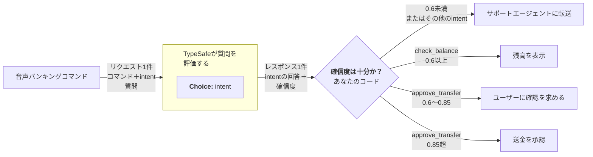

# 確信度ゲートルーティング {#confidence-gated-routing}

> 確信度を第2の軸として活用する。答えは「何をするか」を示し、確信度は「行動すべきか」を示す。

TypeSafeの最も強力な機能の1つが[確信度](/confidence)です。確信度に基づいて意思決定をゲートする方法を意図的に設計することで、信頼性が高く安全なシステムを構築できます。

## 例：音声バンキングコマンド {#example-voice-banking-commands}

ユーザーが口頭で口座を操作できる音声バンキングインターフェースを構築しているとします。ユーザーの意図を解釈する際には常に合理的な確信度が求められますが、アクションによってはリスクが高いものもあり、より高い確信度のしきい値が必要です。



### ステップ1：ユーザーの意図を判定する {#step-1-determine-the-users-intent}

```json title="questions" theme={null}
{
  "intent": {
    "type": "choice",
    "instructions": "ユーザーはどのアクションを要求していますか？",
    "criteria": {
      "check_balance": "口座の残高を確認する",
      "approve_transfer": "保留中の送金リクエストを承認する",
      "other": "その他"
    }
  }
}
```

### ステップ2：確信度ゲートルーティング {#step-2-confidence-gated-routing}

```python theme={null}
action = response.answers["intent"]

# どのアクションでも確信度が0.6未満の場合、人間にルーティングする
if action.confidence < 0.6:
    route_to_support_agent(account_id)

elif action.choice == "check_balance":
    # リスクが低い。確信度0.6で十分。
    show_balance(account_id)

elif action.choice == "approve_transfer":
    if action.confidence > 0.85:
        # リスクは高いが、確信度も高い。自動処理しても安全。
        approve_transfer(account_id)
    else:
        # リスクが高く、確信度は中程度。先に意図を確認する。
        ask_user_to_confirm("確認のためお伺いします：この送金を承認されますか？")

else:
    route_to_support_agent(account_id)
```

0.6のフロアは、モデルが本当に不確かなものをすべて捕捉します。このフロアを超えると、各アクションタイプは誤った分類に基づいて行動した場合の影響に応じた独自のしきい値を持ちます。残高確認は0.6で問題ありません。最悪のケースはユーザーが残高の読み上げを聞くだけだからです。しかし送金の承認には非常に高い確信度（>0.85）が必要であり、それを下回る場合はユーザーに確認を求めるべきです。

確信度についての考え方の詳細は[確信度](/confidence)を参照してください。
