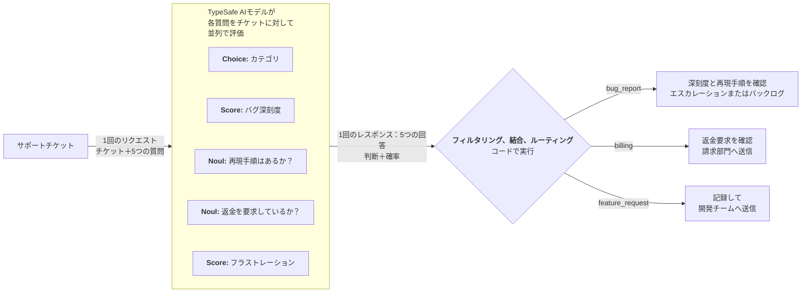

# 投機的ファンアウト {#speculative-fan-out}

> 投機的な質問を含む多数の質問を1回の呼び出しで送信し、関連性の判断はコードに任せましょう。

TypeSafeは1回のAPI呼び出しで多数の質問を送信することをサポートしているため、システムが必要とするすべての質問を1つのリクエストにまとめ、後からコードで関連性を判断することをお勧めします。すべての質問は並列で評価されるため、質問を追加してもレスポンス時間にはほとんど影響しません。

## 例：サポートチケットのトリアージ {#example-support-ticket-triage}

サポートチケットをトリアージする必要があるサポートシステムを構築しているとします。チケットをカテゴリに分類する必要があります。バグレポートの場合は、バグの深刻度も判断する必要があります。

最初にカテゴリを確認し、次にフォローアップ呼び出しで深刻度を確認するのではなく、両方を同時に確認できます。チケットがバグレポートでない場合は、バグ深刻度の質問の結果を単純に無視します。



### ステップ1：投機的ファンアウト {#step-1-speculative-fan-out}

```json title="questions" theme={null}
{
  "category": {
    "type": "choice",
    "instructions": "このサポートチケットの大まかなカテゴリを判断してください",
    "criteria": {
      "bug_report": "ユーザーが壊れているかエラーが発生していることを報告している",
      "billing": "請求、請求書、返金、サブスクリプション",
      "feature_request": "ユーザーが新しい機能を要求している",
      "account": "ログイン、権限、プロフィール、セキュリティ"
    }
  },
  "bug_severity": {
    "type": "score",
    "instructions": "報告された問題の深刻度",
    "criteria": [
      "外見上の問題のみ；機能への影響なし",
      "機能が壊れているか低下している；回避策あり",
      "ブロッキング問題；回避策なし"
    ]
  },
  "has_reproducible_steps": {
    "type": "noul",
    "instructions": "ユーザーが問題を再現するための具体的な手順を説明している"
  },
  "refund_requested": {
    "type": "noul",
    "instructions": "ユーザーが返金またはクレジットを明示的に求めている"
  },
  "frustration": {
    "type": "score",
    "instructions": "ユーザーがどの程度フラストレーションを感じているか",
    "criteria": [
      "冷静で事務的",
      "フラストレーションを感じているが礼儀正しい",
      "非常に怒っている"
    ]
  }
}
```

<Note>
  **投機的な質問：** `bug_severity`と`has_reproducible_steps`はチケットがバグレポートの場合にのみ重要です。`refund_requested`は請求に関する場合にのみ重要です。レスポンス時間への影響がほとんどないため、すべて最初から含めています。チケットが機能要求であることが判明した場合、バグ深刻度の結果は無関係になりますが、その場合はコードパスが単純にそれを無視します。
</Note>

### ステップ2：コードでルーティング {#step-2-route-with-code}

コードは分類結果に基づいて関連性を判断します：

```python title="triage.py" theme={null}
category = response.answers["category"]
bug_severity = response.answers["bug_severity"]
bug_repro = response.answers["has_reproducible_steps"]
refund = response.answers["refund_requested"]
frustration = response.answers["frustration"]

if category.choice == "bug_report":
    if bug_severity.score > 1.5 and bug_repro.noul > 0.6:
        escalate_to_engineering(ticket_id, severity="high")
    else:
        add_to_bug_backlog(ticket_id)

elif category.choice == "billing":
    if refund.noul > 0.7:
        route_to_billing_with_flag(ticket_id, refund_likely=True)
    else:
        route_to_billing(ticket_id)

elif category.choice == "feature_request":
    log_feature_request(ticket_id)

# フラストレーションはカテゴリに関係なく有用
if frustration.score > 1.5:
    flag_for_priority_response(ticket_id)
```

完全な意思決定ツリーに必要なすべての情報は1回の呼び出しから得られます。投機的な質問は無関係な場合は無視され、関連する場合はラウンドトリップを節約します。
