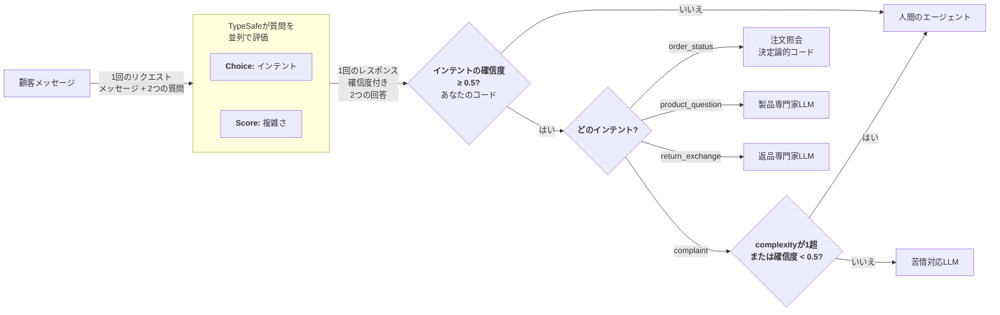

# インテントルーティング {#intent-routing}

> 受信リクエストを分類し、それぞれを最適なハンドラー（決定論的ロジック、専門特化型LLM、または人間）にルーティングします。

すべてのユーザーリクエストが同じ種類のハンドラーを必要とするわけではありません。データベースの検索で回答できるものもあれば、ドメイン固有のコンテキストを持つLLMが必要なもの、人間が必要なものもあります。TypeSafeは、これらすべての前段に配置できる高速で低コストな分類器として機能し、どのハンドラーを呼び出すかを決定します。

## 例：カスタマーサービスのルーティング {#example-customer-service-routing}

カスタマーサービスシステムを構築しているとします。メッセージが届き、適切なハンドラーにルーティングする必要があります。リクエストの種類を判断するために毎回コストの高いLLMにメッセージを送る代わりに、まず分類してからそれに応じてルーティングします。



### ステップ1：インテントと複雑さを分類する {#step-1-classify-intent-and-complexity}

```json title="questions" theme={null}
{
  "intent": {
    "type": "choice",
    "instructions": "この顧客メッセージの主なインテント",
    "criteria": {
      "order_status": "既存の注文について問い合わせている",
      "product_question": "購入前に製品について問い合わせている",
      "return_exchange": "返品または交換を希望している",
      "complaint": "体験に不満があり、解決を求めている"
    }
  },
  "complexity": {
    "type": "score",
    "instructions": "このリクエストを解決するための複雑さ",
    "criteria": [
      "単純な照会または標準的な手順",
      "ある程度の判断や複数ステップのプロセスが必要",
      "通常とは異なる状況、エッジケース、またはエスカレーションが必要"
    ]
  }
}
```

### ステップ2：最適なハンドラーにルーティングする {#step-2-route-to-the-optimal-handler}

```python title="routing.py" theme={null}
def route_ticket(ticket_id, response):
    intent = response.answers["intent"]
    complexity = response.answers["complexity"]

    if intent.confidence < 0.5:
        # 分類の確信度が十分でない場合、人間のエージェントにルーティング
        return route_to_human_agent(ticket_id)

    if intent.choice == "order_status":
        handle_order_status(ticket_id)

    elif intent.choice == "product_question":
        handle_with_llm(ticket_id, PRODUCT_SPECIALIST)

    elif intent.choice == "return_exchange":
        handle_with_llm(ticket_id, RETURNS_SPECIALIST)

    elif intent.choice == "complaint":
        low_confidence = complexity.confidence < 0.5
        # complexity.scoreが高いほど、スケールの「エスカレーションが必要」な側に傾く。
        if complexity.score > 1 or low_confidence:
            # 自動化するには複雑すぎるか、複雑さが不明なため、人間にルーティング。
            route_to_human_agent(ticket_id)
        else:
            handle_with_llm(ticket_id, COMPLAINT_RESOLUTION)
```

あるインテントはLLMを使わない決定論的コードにルーティングされます。2つは異なるコンテキストを持つ異なる専門特化型LLMにルーティングされます。1つは複雑さスコアを使ってLLMと人間のどちらにするかを決定します。TypeSafeは分類を1回の高速な呼び出しですべて処理し、コストの高いリソースは実際にそれを必要とするリクエストにのみ呼び出されます。

複雑さスコアに対する確信度の追加チェックに注目してください。[Confidence](/confidence)で説明したように、システムの文脈と意思決定のリスクを考慮して、低い確信度スコアの意味を常に検討することが重要です。